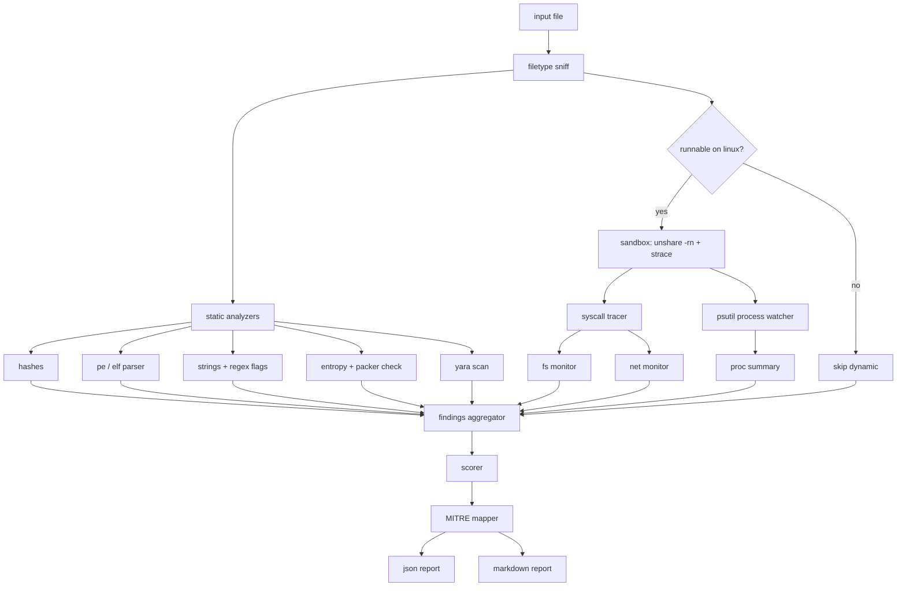

# Crucible

A local, offline malware analysis sandbox for Linux. Crucible takes a
suspicious file, runs a bunch of static checks on it, optionally runs it
inside a contained subprocess to see what it tries to do, and spits out a
JSON and Markdown report with a suspicion score and MITRE ATT&CK tags.

No cloud services. No third party lookups. No telemetry. You give it a
file, it gives you a report.

## Why I built this

I kept finding myself copy pasting the same five commands whenever I wanted
to poke at a random binary I'd downloaded: `file`, `strings`, `sha256sum`,
`readelf`, a quick `strace` on something that probably shouldn't be trusted.
Crucible is those habits glued into one CLI, plus a scorer so I don't have
to eyeball the output every time.

It's a portfolio project so the code tries to be clean and typed and
tested, but it's also genuinely useful for triage work on a Linux box.

## What it does

### Static analysis (always runs)
- File hashes: MD5, SHA1, SHA256
- File type sniffing (ELF, PE, shebang scripts, plain text)
- ELF header parsing with stdlib only: architecture, sections, dynamic
  imports and exports
- PE header parsing via `pefile`: architecture, imports, exports, section
  entropy
- Per-section Shannon entropy and a packed-section heuristic
  (threshold: 7.2 bits per byte)
- Printable strings extraction (ASCII + UTF-16LE) with regex flagging for
  IPs, URLs, registry keys, suspicious Win32 APIs, shell one-liners,
  reverse shell patterns, crypto wallet addresses, and emails
- YARA rule scanning against `rules/` (baseline ruleset included)

### Dynamic analysis (opt-in, Linux only)
- Spawns the target inside a fresh network namespace via `unshare -rn`,
  so any network calls it makes are visible but can't actually reach
  anything
- Wraps the process with `strace -f` to log every syscall
- Tracks child processes and their command lines using `psutil`
- Derives filesystem activity (reads, writes, deletes, sensitive paths)
  from the syscall log
- Derives network activity (socket, connect, bind, sendto) from the
  syscall log
- Enforces a configurable timeout, then kills the whole process group

### Reporting
- Weighted suspicion score (0-100) with per-indicator breakdown
- MITRE ATT&CK technique IDs for every indicator that fired
- Writes both a JSON report and a human-readable Markdown report into
  `reports/` (configurable)

## Architecture



## Install

Requires Linux, Python 3.9+, `strace`, and `unshare`. YARA needs the
`libyara` shared library for `yara-python` to build.

```bash
git clone <this repo>
cd Crucible
make install
```

Or manually:

```bash
pip install -r requirements.txt
pip install -e .
```

## Usage

```bash
# full scan with static + dynamic
crucible scan ./sample.bin

# static only (safer if you don't trust unshare on your box)
crucible scan ./sample.bin --no-dynamic

# longer timeout, verbose logging
crucible scan ./sample.bin --timeout 30 -v

# custom output dir and rules dir
crucible scan ./sample.bin --output /tmp/reports --rules ./my-rules/
```

Running it prints a one-line summary and drops two files under
`reports/`:

```
Suspicion score: 34/100 (medium)
JSON report:     reports/sample_9c1f3b72a1f8.json
Markdown report: reports/sample_9c1f3b72a1f8.md
```

The filename stem includes the first 12 chars of the SHA-256 so repeat
scans don't clobber each other.

## How the scoring works

Every indicator has a per-hit weight and a per-category cap. The total is
clamped to 100. Current weights live in
[`crucible/report/scorer.py`](crucible/report/scorer.py).

| Indicator | Per hit | Cap |
| --- | --- | --- |
| Packed section | 15 | 15 |
| High entropy (not packed) | 8 | 8 |
| YARA rule match | 20 | 40 |
| Suspicious Win32 API string | 5 | 20 |
| Reverse shell string | 15 | 15 |
| Shell one-liner string | 10 | 10 |
| URL string | 3 | 9 |
| IPv4 string | 3 | 9 |
| Network connect attempt | 15 | 15 |
| Network send attempt | 10 | 10 |
| Write to sensitive path | 15 | 30 |
| Write to crontab | 20 | 20 |
| Write to systemd unit dir | 20 | 20 |
| Write to SSH config | 20 | 20 |
| Shell child process | 10 | 10 |
| Downloader child process | 15 | 15 |

Score label bands:

| Range | Label |
| --- | --- |
| 0-24 | low |
| 25-49 | medium |
| 50-74 | high |
| 75-100 | critical |

## MITRE ATT&CK mapping

Indicator keys map to one or more technique IDs. The table is in
[`crucible/report/mitre.py`](crucible/report/mitre.py). A few examples:

| Crucible indicator | ATT&CK technique |
| --- | --- |
| packed_sections | T1027.002 Software Packing |
| suspicious_api_import | T1055 Process Injection, T1106 Native API |
| reverse_shell_strings | T1059.004 Unix Shell |
| url_strings | T1071.001 Web Protocols |
| network_send | T1041 Exfiltration Over C2 Channel |
| write_crontab | T1053.003 Cron |
| write_ssh | T1098.004 SSH Authorized Keys |

## Safety notes

The dynamic stage runs the sample on your actual host, just with a new
network namespace and strace wrapping. That's not a real VM. If you're
looking at known-nasty samples, spin up a throwaway VM first. Pass
`--no-dynamic` anytime you only want to poke at the bytes without
executing anything.

Crucible will only execute ELF binaries and script files on Linux. PE
files always skip dynamic analysis with a clear reason in the report.

## Tests

```bash
make test
```

Covers hashing, entropy math, string regex flagging, scorer boundaries,
MITRE mapping, tracer line parsing, and filesystem syscall classification.

## Layout

```
crucible/
├── crucible/            # the package
│   ├── cli.py
│   ├── static/          # hashes, entropy, strings, pe, elf, yara
│   ├── dynamic/         # sandbox, tracer, fs/net/proc monitors
│   ├── report/          # scorer, mitre, json + markdown renderers
│   └── utils/
├── rules/               # baseline YARA rules
├── reports/             # generated reports go here
├── tests/
├── requirements.txt
├── pyproject.toml
└── Makefile
```

## Limitations

- Linux host only. The dynamic stage relies on strace and unshare.
- PE files get static analysis only. No Wine bridge on purpose to keep
  deps light.
- Not a replacement for a real sandbox like Cuckoo. Treat the dynamic
  stage as "extra signal", not containment.
- YARA rules included are generic starters. Drop your own into `rules/`.

## License

MIT.
