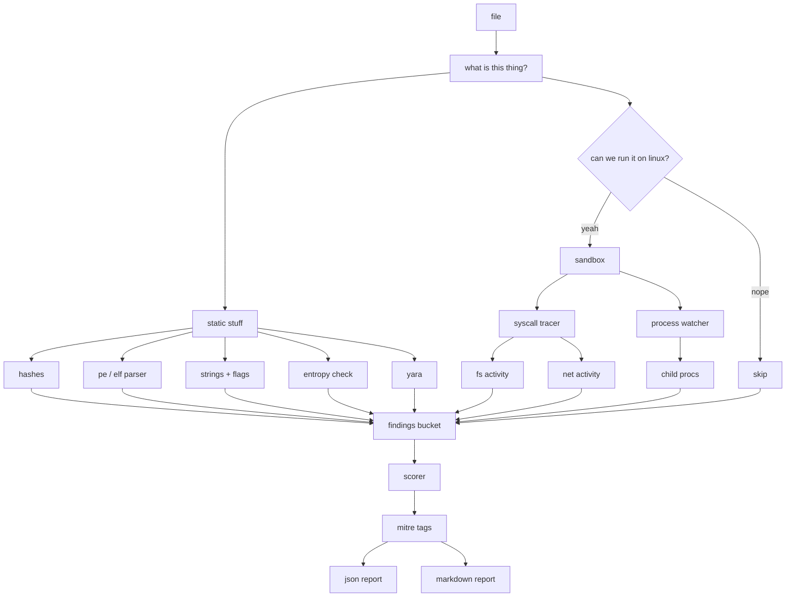

# Crucible

you throw a sketchy file at it, it tells you how sketchy the file is. that's it.

it's a CLI tool that runs entirely on your laptop (no cloud, no signups, no calling home), does a bunch of static checks on whatever you point it at, optionally runs the thing in a little cage to watch what it tries to do, and then dumps a report with a score out of 100.

## why

i kept typing the same five commands every time someone sent me a weird file. `file`, `strings`, `sha256sum`, maybe `readelf` if i was being fancy, then `strace` if i was brave. after the hundredth time i figured i'd just glue them together and add a scorer so i don't have to squint at output. this is that.

also it's a portfolio thing so the code is reasonably clean, tests exist, docstrings aren't lies, etc.

## what it actually does

### stuff it does to the file without running it
- md5 / sha1 / sha256 hashes (standard triage stuff)
- sniffs what kind of file it is (elf, pe, shell script, python, plain text)
- parses elf headers in pure stdlib, no extra libs needed
- parses pe headers using `pefile` (imports, exports, sections)
- calculates entropy per section to catch packers (anything above 7.2 bits/byte is probably compressed or encrypted)
- rips out all the printable strings (ascii + utf-16le because windows malware loves wide strings) and runs regexes to flag the spicy ones: ips, urls, registry keys, `VirtualAlloc` / `CreateRemoteThread` / friends, reverse shell one-liners, crypto wallet addresses, emails
- runs yara rules against it (there's a starter ruleset in `rules/`, drop your own in there)

### stuff it does while the file is running (if you let it)
- spawns it inside `unshare -rn` so it gets a brand new network namespace with no interfaces. it can still *try* to make network calls, we just catch them and they go nowhere
- wraps the process with `strace -f` to log every syscall it and its children make
- uses `psutil` to watch any child processes that spawn
- figures out fs activity (what got read, what got written, what got deleted, what hit sensitive spots like `/etc/cron.d` or `~/.ssh`) by looking at the syscall log
- same for network: socket, connect, bind, sendto
- has a timeout, kills the whole process group when it fires

### what you get back
- a 0-100 score with reasons
- matching MITRE ATT&CK technique IDs for whatever tripped
- a json file (good for piping into other tools) and a markdown file (good for reading with your eyes), both dropped into `reports/`

## how it's wired together



## getting it running

you need linux, python 3.9 or newer, `strace`, `unshare`, and `libyara` for the yara bindings.

```bash
git clone <this repo>
cd Crucible
make install
```

or if you'd rather do it by hand:

```bash
pip install -r requirements.txt
pip install -e .
```

## using it

```bash
# normal scan, static + dynamic
crucible scan ./weird_file

# static only, if you don't want to execute anything
crucible scan ./weird_file --no-dynamic

# longer timeout and chatty logs
crucible scan ./weird_file --timeout 30 -v

# put reports somewhere else, use your own yara rules
crucible scan ./weird_file --output /tmp/out --rules ./my-rules/
```

you'll get something like:

```
Suspicion score: 34/100 (medium)
JSON report:     reports/sample_9c1f3b72a1f8.json
Markdown report: reports/sample_9c1f3b72a1f8.md
```

filenames include the first 12 chars of the sha256 so rerunning on the same file overwrites cleanly and different files don't clobber each other.

## how the score gets made

it's a bag of points. every indicator has a per-hit value and a cap so one noisy thing can't blow up the total. add it all up, clamp at 100. full table is in [`crucible/report/scorer.py`](crucible/report/scorer.py) if you want to mess with the weights.

| thing | points per hit | cap |
| --- | --- | --- |
| packed section | 15 | 15 |
| high entropy (not quite packed) | 8 | 8 |
| yara rule match | 20 | 40 |
| win32 api string | 5 | 20 |
| reverse shell string | 15 | 15 |
| shell one-liner string | 10 | 10 |
| url in strings | 3 | 9 |
| ipv4 in strings | 3 | 9 |
| tried to `connect()` | 15 | 15 |
| tried to `sendto()` | 10 | 10 |
| write to sensitive path | 15 | 30 |
| write to crontab | 20 | 20 |
| write to systemd unit dir | 20 | 20 |
| write to ssh config | 20 | 20 |
| spawned a shell | 10 | 10 |
| spawned curl / wget / nc | 15 | 15 |

labels:

| score | label |
| --- | --- |
| 0-24 | low |
| 25-49 | medium |
| 50-74 | high |
| 75-100 | critical |

## mitre tags

every indicator maps to one or more ATT&CK technique IDs. table lives in [`crucible/report/mitre.py`](crucible/report/mitre.py). examples:

| what tripped | mitre |
| --- | --- |
| packed_sections | T1027.002 Software Packing |
| suspicious_api_import | T1055 Process Injection, T1106 Native API |
| reverse_shell_strings | T1059.004 Unix Shell |
| url_strings | T1071.001 Web Protocols |
| network_send | T1041 Exfiltration Over C2 Channel |
| write_crontab | T1053.003 Cron |
| write_ssh | T1098.004 SSH Authorized Keys |

## don't be dumb

the dynamic stage runs the file on your actual machine, just in a network namespace with strace attached. that is *not* a real sandbox. if you're poking at something you know is bad, boot a vm first. use `--no-dynamic` when you just want to look at the bytes without executing anything.

pe files never get executed. you'll get static analysis and a note in the report.

## tests

```bash
make test
```

covers hashes, entropy math, string flagging, filetype sniffing, scorer edge cases, mitre mapping, strace line parsing, and syscall -> fs classification. the suite runs in under a second.

## layout

```
crucible/
├── crucible/            # the actual package
│   ├── cli.py
│   ├── static/          # hashes, entropy, strings, pe, elf, yara
│   ├── dynamic/         # sandbox + monitors
│   ├── report/          # scorer, mitre, json + markdown
│   └── utils/
├── rules/               # yara rules
├── reports/             # output lands here
├── tests/
├── requirements.txt
├── pyproject.toml
└── Makefile
```

## what it isn't

- not a windows tool. linux only because the dynamic bits need strace and unshare.
- pe files get static only, no wine. keeping dependencies small on purpose.
- not trying to be cuckoo or any.run. treat the dynamic stage as a hint, not containment.
- the bundled yara rules are generic starters. drop real ones in `rules/` for anything serious.

## license

MIT. See [LICENSE](LICENSE).
